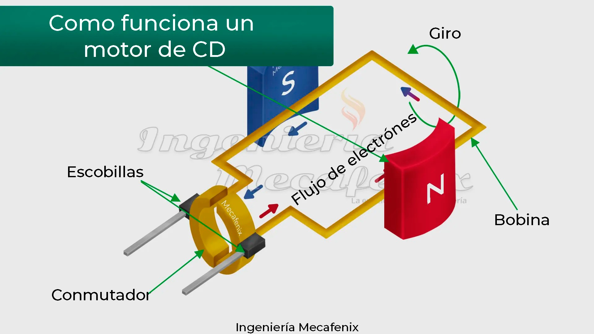
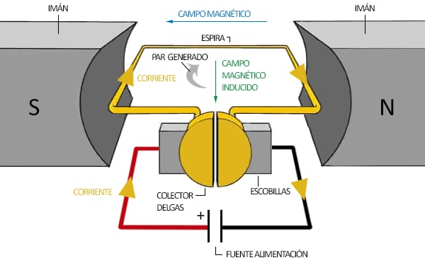
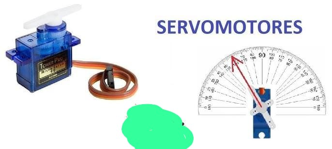

# Actuadores convencionales en Robótica Móvil

## Motor de Corriente Directa (C.D.)
- Consta de electroimanes (a través de un embobinado) e imanes para generar el movimiento rotatorio.  

### Características
- Es un motor que al momento de energizarse genera movimiento rotacional hasta alcanzar su velocidad máxima (**RPM's**).  
- Es altamente utilizado en R.M. ya que está perfectamente modelado matemáticamente, e incluso su modelo simplificado es lineal.  
- Permite invertir su giro solamente invirtiendo la polaridad de la alimentación (ejem. batería).  
- También se puede controlar su **velocidad** cambiando el nivel de voltaje/corriente o añadiendo resistencias.  
- Altamente empleados para generar el desplazamiento de un robot alinearando su eje con llantas o hélices.  

---

## Servomotores
Los servomotores son:
- Motor de C.D.  
- Controlador  
- Sensor  

Permiten controlar del motor **la posición angular**; es decir, estos motores, aunque estén energizados, **no giran indistintamente**.

### Características
- Requieren de una señal externa que le diga al controlador dónde posicionar (medido en grados) la posición del eje del motor.  
- No se mueven hasta que se le dé otra señal al controlador.  

## Motor de Corriente Alterna (C.A.)
- Motor que utiliza la **C.A.** para generar movimiento.  
- Muy útiles para generar **grandes velocidades** y **altos pares de torsión**.  
- Su control de velocidad, posición y sentido de giro es **costoso**.  

### Características
- Es un motor que al momento de energizarse genera movimiento rotacional hasta alcanzar su velocidad máxima (**RPM's**).  
- Es altamente utilizado en **R.M.** ya que está perfectamente modelado matemáticamente, e incluso su modelo simplificado es lineal.  
- Permite invertir su giro solamente invirtiendo la polaridad de la alimentación (ejem. batería).  
