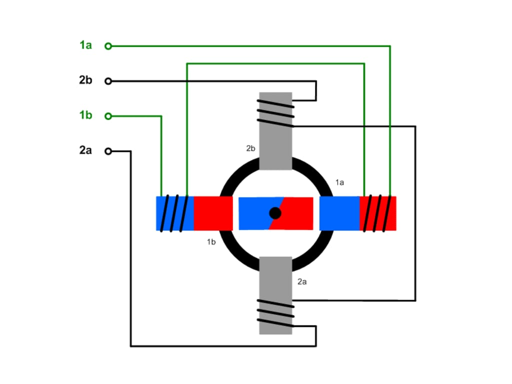
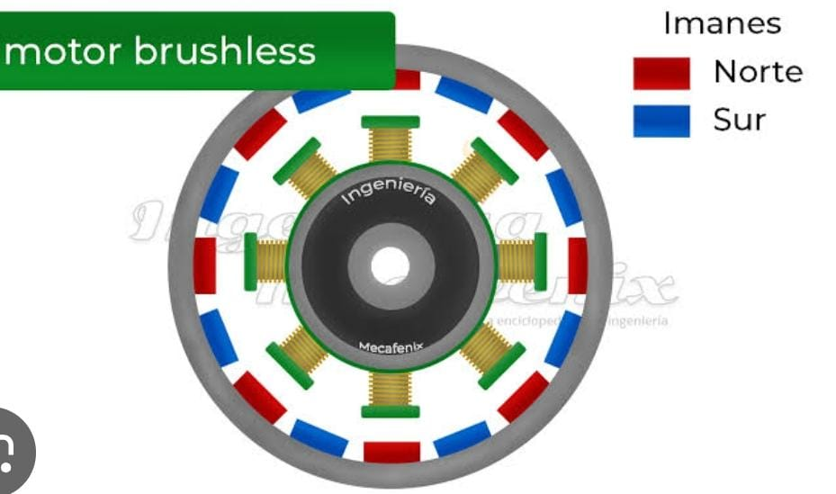
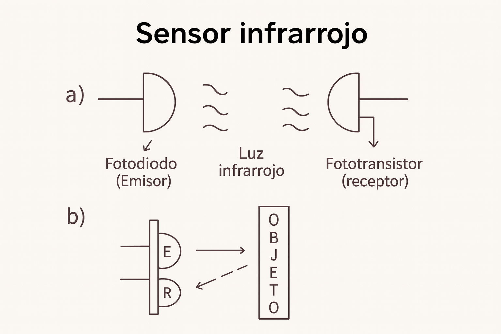
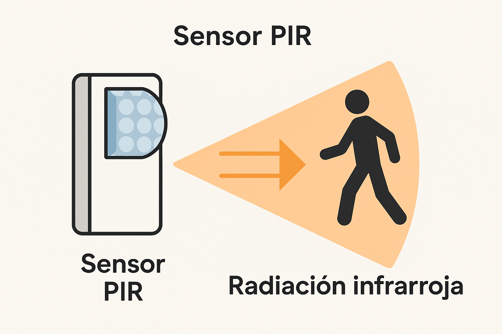
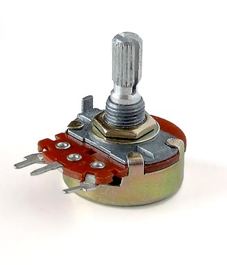

## Motor a Pasos
- Es un motor con **múltiples embobinados en círculo**.  
- Con imanes en el eje de rotación.  
- Los embobinados se energizan de manera independiente, atrayendo a los imanes y por tanto rotando al eje **a pasos**.  

### Características
- Tiene la ventaja de que se puede controlar la **velocidad de giro** dependiendo de la energización de las bobinas.  
- Además, se puede controlar el **ángulo de rotación**, pues los pasos equivalen a aprox. **1.8°**.  
- Requieren de **drivers externos** para energizar las bobinas.  
- No pueden girar a **altas velocidades**.  
- Se pueden **posicionar**, pero si la carga los mueve, estos no regresan a su posición como los servomotores.  

### Aplicaciones
- Se solían usar en **impresoras**.  

## Motor Brushless
- Es un motor con **varios embobinados**, que evita que haya fricción entre estos.  
- Tiene una **secuencia predeterminada de encendido**.  
- Diseñados para alcanzar **altas velocidades**.  

### Características
- Usados principalmente en **drones**.  
- Generan **poco par torsor** comparado con otros tipos de motores.  

# Sensores en Robótica Móvil

## Sensor Infrarrojo
El sensor infrarrojo está compuesto por:  
- **Fotodiodo emisor**: genera la luz infrarroja.  
- **Fototransistor receptor**: actúa como un interruptor electrónico que se activa al recibir la luz infrarroja.  

### Funcionamiento
- El LED emite luz infrarroja y el fototransistor detecta si la luz llega o no.  
- Puede trabajar en dos modalidades:  
  - **Reflexión**: la luz rebota en un objeto y vuelve al receptor.  
  - **Barrera**: la luz viaja directamente del emisor al receptor y se interrumpe si un objeto se coloca en medio.  

### Características
- Permite **detectar presencia de objetos**.  
- Se usa comúnmente en **sensores de línea** (robots seguidores de línea).  

## Sensor PIR
- Parte de un material que, cuando hay **cambios de temperatura**, genera una **diferencia de potencial**.  

### Características
- Detecta variaciones en la **radiación infrarroja** emitida por los cuerpos.  
- Se emplea principalmente para **detección de movimiento**.  

## Potenciómetro como Sensor
El potenciómetro es una **resistencia variable**, cuya magnitud se puede modificar a través de una perilla.  
Con ello se pueden sensar **variables mecánicas** como la **posición angular**.  

### Características
- En robótica, son convencionales en los **mandos o controles a distancia**.  
- Permiten convertir el movimiento angular de un eje en una **variación eléctrica** (voltaje o resistencia).  
